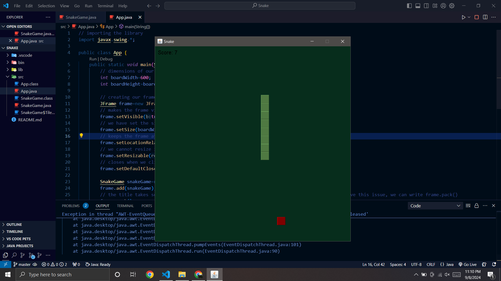

# Snake Game

This Java Snake game, built with Swing, challenges players to navigate a snake using arrow keys, eat food to grow, and avoid collisions with the walls and itself. It features game-over logic and real-time score tracking, making it a valuable example for learning Java GUI design and basic game development principles.

## Screenshots
Here are some screenshots of the game:

  

## Features
- **Arrow Key Controls**: Navigate the snake in four directions.
- **Growth Mechanics**: The snake grows longer each time it eats food.
- **Collision Detection**: Avoid crashing into the walls or the snake’s own body.
- **Score Tracking**: Real-time score display based on snake length.
- **Game Over Handling**: Displays a game-over screen and score when the game ends.

## Installation
To get started with the Snake Game, follow these steps:
1. **Clone the Repository**: Run `git clone https://github.com/Aastha-Bhatia/Snake-Game.git` to clone the repository to your local machine.
2. **Navigate to the Project Directory**: Use `cd Snake-Game` to enter the project directory.
3. **Compile the Code**: Execute `javac -d bin src/App.java` to compile the Java source code. You can view the source code directly at [src/App.java](https://github.com/Aastha-Bhatia/Snake-Game/blob/main/Snake/src/App.java).
4. **Run the Game**: Launch the game by running `java -cp bin App`.

## Contributing
If you wish to contribute to this project:
- **Fork the Repository**: Click the "Fork" button at the top right of this page.
- **Create a New Branch**: Use `git checkout -b feature-branch` to create a new branch for your changes.
- **Make Your Changes**: Implement your improvements or features.
- **Commit Your Changes**: Commit your changes with `git commit -am 'Add new feature'`.
- **Push to the Branch**: Push your changes to your fork with `git push origin feature-branch`.
- **Create a Pull Request**: Go to the repository on GitHub and click "New Pull Request" to submit your changes.

## License
This project is licensed under the MIT License. See the LICENSE file for details.

## Acknowledgements
- **Inspiration**: Classic arcade games.
- **Libraries Used**: Java Swing for GUI development.
- **Learning Resources**: Special thanks to Kenny Yip's coding YouTube videos, which provided valuable insights and guidance for developing this game.

